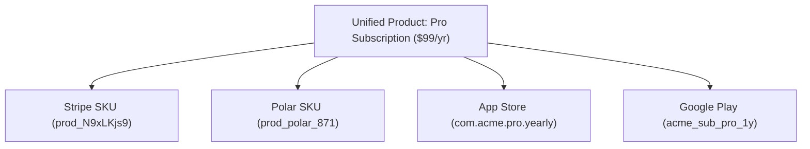

Understanding the basic entities in Indic8 will help you organize products, gateways, and metrics effectively.

## 1. Unified Product vs Provider SKU

A single product (for example, *Pro Subscription*) is often sold across multiple distinct platforms:
- On the web via **Stripe** (`prod_N9xLKjs9`) or **Polar** (`prod_polar_871`)
- On iOS via **Apple App Store** (`com.acme.pro.yearly`)
- On Android via **Google Play** (`acme_sub_pro_1y`)

In Indic8:
- A **Provider SKU** represents the raw external identifier in the respective gateway.
- A **Unified Product** aggregates these provider SKUs into a single entity, allowing you to analyze total blended sales, active subscriptions, and blended refund rates.

---

## 2. Multi-Gateway Ledger

The **Ledger** is an immutable, append-only table of financial events. Every successful charge, subscription renewal, dispute, and refund is recorded as a normalized transaction:

- **Gross Volume**: Total charged amount in the customer's native currency.
- **Normalized Volume**: Equivalent value in your workspace base currency at the timestamp rate.
- **Provider Fee**: Gateway transaction cuts and platform fees.
- **Net Volume**: Actual capital deposited into your account (`Gross - Provider Fees - Taxes`).

---

## 3. Sovereign Hashing

Indic8 calculates customer retention and repeat purchase velocity without storing Personally Identifiable Information (PII).

When an email address (e.g. `alex@example.com`) arrives in a webhook:
1. Indic8 extracts the domain and normalizes the string.
2. The string is combined with a workspace-secret cryptographic salt.
3. An SHA-256 hash is computed (e.g. `usr_9f81a7b6c...`).
4. The raw email is permanently deleted from memory.

This allows Indic8 to track whether `usr_9f81a7b6c` renewed in Month 3 without ever knowing their real identity.

---

## 4. Cohort Vintage Analysis

Cohorts are groups of customers who made their first purchase or subscription in the same calendar month.

Indic8 evaluates cohorts across two primary metrics:
- **Net Revenue Retention (NRR)**: Percentage of recurring revenue retained from the original cohort over time, factoring in expansions, upgrades, downgrades, and churn.
- **Blended LTV**: Average cumulative revenue generated by a customer across all channels after $N$ months.

---

## 5. Milestone Verification

Indic8 includes an automated milestone detection engine. When your workspace crosses key thresholds ($10k MRR, $100k Gross, 1,000 active subscribers, or Highest Revenue Day):
- A cryptographic snapshot is signed by the Indic8 telemetry engine.
- A Studio Canvas export card is generated with verification hashes.
- You can share the verified card on social media or embed it in investor pitch decks.
