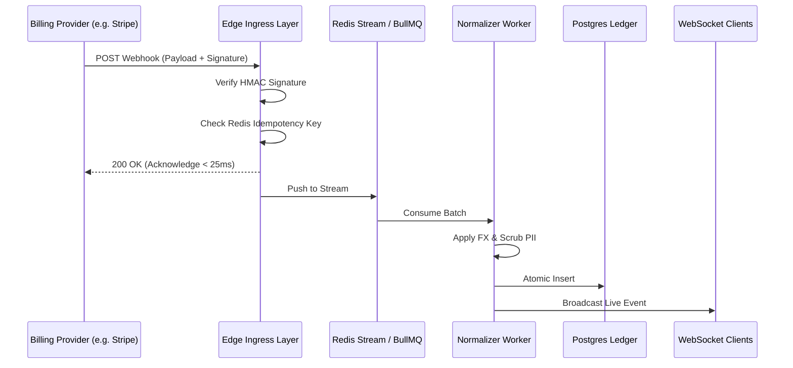

Indic8 is engineered to process incoming webhook events from diverse payment processors at high throughput.

## Pipeline Lifecycle

---

## Key Guarantees

### 1. Sub-25ms Gateway Acknowledgments
Payment providers like Stripe and Lemon Squeezy will disable webhooks if response latencies spike. Indic8 immediately acknowledges receipt with `200 OK` after verifying cryptographic signatures, offloading data persistence to background queues.

### 2. Idempotency and Deduplication
Network retries frequently cause duplicate webhook deliveries. Indic8 derives a composite key:

$$\text{Idempotency Key} = \text{SHA256}(\text{provider} + \text{event\_id} + \text{timestamp})$$

Any duplicate event received within 48 hours is acknowledged as successful but discarded before ledger mutation.

### 3. Out-of-Order Resolution
Events like `customer.subscription.deleted` can occasionally arrive before `customer.subscription.created` due to network routing anomalies. Indic8 uses optimistic locking and state reconcilers to reconstruct the true chronological state.
