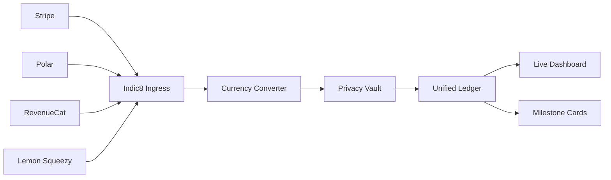

# Welcome to Indic8

Indic8 brings all your sales, subscriptions, and payment providers into one live dashboard. It converts different currencies automatically, tracks customer renewals, and never stores raw customer credit card details.

<CardGroup cols={2}>
  <Card title="Quickstart Guide" icon="bolt" href="/quickstart">
    Connect your first payment gateway and view live revenue in under 3 minutes.
  </Card>
  <Card title="Gateway Integrations" icon="plug" href="/integrations/overview">
    Step-by-step guides for Stripe, Polar, RevenueCat, Lemon Squeezy, Apple, and Google.
  </Card>
  <Card title="Self-Hosting Guide" icon="server" href="/self-hosting/docker-compose">
    Deploy on your own server with Docker Compose or serverless on Vercel and Neon.
  </Card>
  <Card title="API Reference" icon="code" href="/api-reference/overview">
    Explore the REST API and live WebSocket feed for custom integrations.
  </Card>
</CardGroup>

---

## Why Indic8?

Most software businesses sell products through more than one platform:
- Web subscriptions on **Stripe** or **Polar**
- Mobile in-app purchases on **Apple App Store** and **Google Play**
- Digital downloads on **Lemon Squeezy** or **Paddle**

Checking multiple dashboards every day makes it hard to see your true total Monthly Recurring Revenue (MRR) or track how many active subscribers you have.

Indic8 connects all these payment streams into one clear, real-time view.

---

## Key Features

| Feature | What it does for you |
| :--- | :--- |
| **All-in-One Dashboard** | See your total sales, MRR, and customer count in one place |
| **Automatic Currency Conversion** | Converts EUR, GBP, JPY, and other currencies into your main currency |
| **Zero-PII Privacy Vault** | Never stores customer credit cards, names, or raw email addresses |
| **Cohort Retention** | See what percentage of customers renew month after month |
| **Milestone Cards** | Create verified cards to share revenue achievements on social media |
| **100% Open Source** | Free to self-host on your own servers with zero limits |

---

## How It Works

1. **Connect**: Add a webhook URL in your provider dashboard.
2. **Sync**: Indic8 verifies each payment event in real time.
3. **Convert**: Non-USD payments are converted using European Central Bank rates.
4. **Display**: Your dashboard updates instantly without refreshing.

---

## Next Steps

<Steps>
  <Step title="Follow the Quickstart">
    Get started in 3 minutes in our [Quickstart Guide](/quickstart).
  </Step>
  <Step title="Connect your Providers">
    Follow the step-by-step instructions in [Integrations](/integrations/overview).
  </Step>
  <Step title="Customize Settings">
    Set your workspace currency and invite your team.
  </Step>
</Steps>
