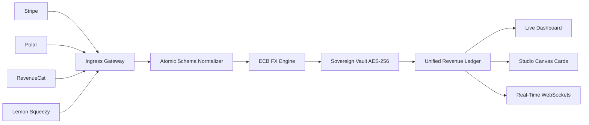

import { CheckIcon, ShieldCheckIcon, GlobeAltIcon, ChartBarIcon } from '@heroicons/react/24/outline'

# Welcome to Indic8

Indic8 is a high-throughput, sovereign revenue intelligence platform. It consolidates asynchronous payment events across multiple billing providers into a real-time ledger, calculates instant foreign exchange normalization, and computes cohort retention metrics with zero customer PII storage.

<CardGroup cols={2}>
  <Card title="Quickstart Guide" icon="bolt" href="/quickstart">
    Connect your first payment gateway and view live revenue telemetry in under 3 minutes.
  </Card>
  <Card title="Gateway Integrations" icon="plug" href="/integrations/overview">
    Connect Stripe, Polar, RevenueCat, Lemon Squeezy, App Store, and Google Play.
  </Card>
  <Card title="Self-Hosting Guide" icon="server" href="/self-hosting/docker-compose">
    Deploy your sovereign instance with Docker Compose or serverless on Vercel and Neon.
  </Card>
  <Card title="API Reference" icon="code" href="/api-reference/overview">
    Explore the REST and WebSocket endpoints for custom ingress and telemetry feeds.
  </Card>
</CardGroup>

## Why Indic8?

Modern software companies rarely rely on a single payment provider. You might sell web subscriptions through Stripe or Polar, mobile in-app purchases via RevenueCat and the Apple App Store, and digital assets via Lemon Squeezy.

This fragmented stack leads to common operational hurdles:
- Disconnected dashboards with inconsistent metric definitions.
- Manual currency conversion spreadsheets that delay monthly reporting.
- High risk of customer data leakage when exporting raw CSVs.
- Inability to compare cross-channel retention and customer lifetime value.

Indic8 unifies these disparate streams into a single sovereign pane of glass.

---

## Core Pillars

<CardGroup cols={3}>
  <Card title="Universal Ingress" icon="layer-group">
    Sub-2ms atomic ingestion normalizes webhook events from every major payment provider into a single schema.
  </Card>
  <Card title="Automated FX Rates" icon="globe">
    Real-time European Central Bank rates convert global multi-currency transactions into your base reporting currency.
  </Card>
  <Card title="Zero-PII Sovereign Vault" icon="shield-halved">
    Client-side AES-256-GCM encryption ensures customer emails, names, and cards never touch persistent storage.
  </Card>
  <Card title="Cohort Intelligence" icon="chart-line">
    Track Net Revenue Retention (NRR), blended customer lifetime value (LTV), and cross-provider vintage curves.
  </Card>
  <Card title="Studio Canvas" icon="sparkles">
    Generate shareable, verified proof-of-revenue milestone cards for community updates and investor reports.
  </Card>
  <Card title="Open Source & Cloud" icon="cube">
    100% Free and Open Source under AGPLv3 for self-hosters, with a managed cloud option for zero-ops teams.
  </Card>
</CardGroup>

---

## How It Works

1. **Ingestion**: Webhook payloads hit the edge ingress gateway with signature verification.
2. **Normalization**: Heterogeneous schemas are mapped to the canonical `Transaction` model.
3. **FX Translation**: Non-base currencies are translated using exact timestamped ECB spot rates.
4. **Sovereign Scrubbing**: Personal customer identifiers are redacted or encrypted client-side.
5. **Broadcasting**: Real-time updates push via WebSocket directly to your dashboard.

---

## Next Steps

<Steps>
  <Step title="Follow the Quickstart">
    Get up and running locally or on the cloud in [Quickstart](/quickstart).
  </Step>
  <Step title="Connect Gateways">
    Configure webhook endpoints for your billing providers in [Integrations](/integrations/overview).
  </Step>
  <Step title="Explore the API">
    Learn how to query metrics programmatically in the [API Reference](/api-reference/overview).
  </Steps>
</Steps>
