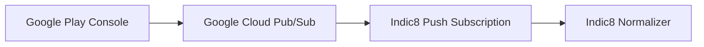

Connect Google Play to ingest Android in-app purchases, recurring subscription states, grace periods, and account holds.

## Architecture

Google Play uses Google Cloud Pub/Sub to deliver Real-Time Developer Notifications (RTDN).

## Quick Setup

<Steps>
  <Step title="Create a Pub/Sub Topic">
    1. Open the [Google Cloud Console](https://console.cloud.google.com).
    2. Go to **Pub/Sub > Topics** and create a topic named `indic8-play-notifications`.
    3. Grant publisher rights to `google-play-developer-notifications@system.gserviceaccount.com`.
  </Step>

  <Step title="Create a Push Subscription">
    1. Create a subscription attached to the topic above.
    2. Set Delivery Type to **Push**.
    3. Enter the Endpoint URL from Indic8 (**Settings > Integrations > Google Play**).
  </Step>

  <Step title="Configure Google Play Console">
    1. Open [Google Play Console](https://play.google.com/console).
    2. Go to **Monetization setup**.
    3. Under **Real-time developer notifications**, enter your full Pub/Sub topic name:
       `projects/your-project-id/topics/indic8-play-notifications`.
    4. Click **Send test notification** to verify.
  </Step>
</Steps>
